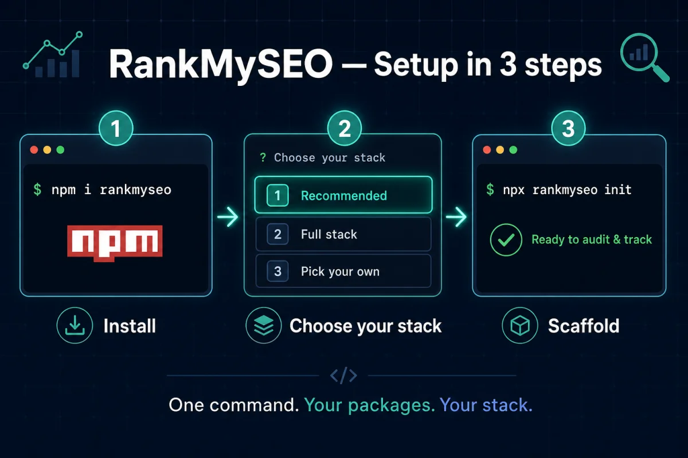

# RankMySEO

An open-source, framework-agnostic SEO toolkit for the JavaScript/TypeScript ecosystem. Drop it into any JS/TS app — Next.js, Hono, SvelteKit, Express, Workers, plain Node — with keyword/rank tracking, SEO audits, persistent reports, an AI agent layer, and a customizable dashboard.

**Status:** M1–M4 feature verticals implemented (offline-verified with fixture datasource + mock LLM). Published on npm under the [`@rankmyseo`](https://www.npmjs.com/org/rankmyseo) scope (v0.1.x).

**Documentation:** [GitHub Wiki](https://github.com/madebyaris/rankmyseo/wiki) (source: [`docs/wiki/`](./docs/wiki/))

## Why RankMySEO?

Most SEO tooling is locked to a single platform or shipped as a hosted SaaS iframe. RankMySEO is a **composable npm package set**:

- **Headless core** — domain logic and ports with zero framework dependencies
- **Your database** — Drizzle adapter today (SQLite); Postgres/MySQL and optional Prisma/Kysely adapters planned (M5)
- **Your stack** — thin adapters per framework; the dashboard never touches your DB directly
- **Multi-tenant ready** — every row is scoped by `tenantId` + `projectId`

See the [Architecture](https://github.com/madebyaris/rankmyseo/wiki/Architecture) and [Roadmap](https://github.com/madebyaris/rankmyseo/wiki/Roadmap-and-License) wiki pages for the full architecture, roadmap, and design decisions.

## Install



**Easiest path** — interactive installer (recommended, full, or pick your own packages):

```bash
npm i rankmyseo
npx rankmyseo install
```

Non-interactive:

```bash
npx rankmyseo install --yes --preset recommended   # core + storage + server-hono + react + cli
npx rankmyseo install --preset full                # all @rankmyseo/* packages
npx rankmyseo install --packages @rankmyseo/core,@rankmyseo/ui
```

After install, scaffold your project:

```bash
npx rankmyseo init
npx rankmyseo migrate
```

**Manual install** — pick packages yourself under the [`@rankmyseo`](https://www.npmjs.com/org/rankmyseo) scope (Node.js ≥ 20):

```bash
# Backend — Hono example (server + storage + headless core)
npm i @rankmyseo/server-hono @rankmyseo/storage @rankmyseo/core hono

# Frontend — headless hooks + optional prebuilt dashboard UI
npm i @rankmyseo/react @rankmyseo/ui react react-dom

# CLI — init, migrate, schedule (or use `npx rankmyseo` after `npm i rankmyseo`)
npm i -D @rankmyseo/cli
```

Other adapters/utilities: [`@rankmyseo/server`](https://www.npmjs.com/package/@rankmyseo/server) (framework-agnostic handler), [`@rankmyseo/datasource`](https://www.npmjs.com/package/@rankmyseo/datasource) (GSC/PSI/fixture), [`@rankmyseo/scheduler`](https://www.npmjs.com/package/@rankmyseo/scheduler) (cron), [`@rankmyseo/agent`](https://www.npmjs.com/package/@rankmyseo/agent) (AI + MCP).

## How to use it

1. **Spin up the backend** — mount the API with a framework adapter (Hono shown below), pointed at a database via `@rankmyseo/storage`. See [Minimal Hono integration](#minimal-hono-integration).
2. **Create a project + keywords** — via the store directly or the [API routes](#api-scoping) (`POST /projects`, `POST /keywords`).
3. **Scan & audit pages** — `POST /scan` fetches a live URL, extracts on-page signals, and returns a score + prioritized recommendations.
4. **Render a dashboard (optional)** — wrap your app in `RankMySeoProvider` from `@rankmyseo/react`, then drop in widgets from `@rankmyseo/ui` (or just use the headless hooks).
5. **Scaffold/migrate with the CLI** — `npx rankmyseo init` then `npx rankmyseo migrate` (after `npm i rankmyseo` or `@rankmyseo/cli`).
6. **Generate structured data** — `POST /schema/generate` or the dashboard **Schema generator** tab for rich-result JSON-LD.

Each package's npm page and the [Wiki](https://github.com/madebyaris/rankmyseo/wiki) carry per-package usage details.

## Packages

| Package | Description |
| --- | --- |
| [`rankmyseo`](./packages/rankmyseo) | **npm installer** — `npx rankmyseo install` (recommended / full / custom) |
| [`@rankmyseo/core`](./packages/core) | Zod schemas, audit engine, report rollup, config loader, ports (`RankStore`, `RankDataSource`, `Scheduler`) |
| [`@rankmyseo/storage`](./packages/storage) | Default Drizzle SQLite adapter (`createStore`) |
| [`@rankmyseo/datasource`](./packages/datasource) | Fixture (offline default), Google Search Console rank source + PageSpeed Insights client |
| [`@rankmyseo/scheduler`](./packages/scheduler) | `NodeCronScheduler` + `ManualScheduler` for rank ingestion jobs |
| [`@rankmyseo/server`](./packages/server) | Framework-agnostic HTTP handler (`Request` / `Response`) — full API + site features |
| [`@rankmyseo/server-hono`](./packages/server-hono) | Hono adapter — `createRankMySeoApp(store, options?)` |
| [`@rankmyseo/agent`](./packages/agent) | AI SDK tools + MCP server for dashboard customization |
| [`@rankmyseo/scanner`](./packages/scanner) | SSRF-safe live page fetch used by `/scan` and the regression CLI |
| [`@rankmyseo/react`](./packages/react) | Headless hooks + on-page collector (`web-vitals`) |
| [`@rankmyseo/ui`](./packages/ui) | Widget registry + `DashboardRenderer` (custom `.rms-*` CSS, no Tailwind/shadcn in consumer apps) |
| [`@rankmyseo/cli`](./packages/cli) | `init`, `migrate`, `schedule`, `doctor`, `regression check` |

Planned (M5): `@rankmyseo/vue`, `@rankmyseo/svelte`, `@rankmyseo/server-next`, Postgres store adapters, more framework adapters.

## What's working today (M0–M4)

| Area | Status |
| --- | --- |
| Keyword CRUD + rank snapshots | ✓ |
| SQLite persistence (audits, reports, dashboard config) | ✓ |
| Multi-tenant scoping (`tenantId` + `projectId`) | ✓ |
| Audit engine + on-page collector (`POST /collect`) | ✓ |
| Live website scan (`POST /scan` — fetch URL → signals → score + recommendations) | ✓ |
| Meta generator (`POST /meta/generate` — title/og/JSON-LD, audit-verified) | ✓ |
| Schema generator (`POST /schema/generate` — Article/Product/FAQ/Breadcrumb/Organization JSON-LD) | ✓ |
| Blog system with keyword intent + auto meta (`/blog` CRUD) | ✓ opt-in via `siteFeatures.blog` + `BlogManager` widget |
| Recommendation engine (per-scan + per-post, prioritized) | ✓ |
| Report rollup (`POST/GET /reports`) | ✓ |
| Rank ingestion service + scheduler port | ✓ |
| Datasource adapters (fixture default; GSC real class) | ✓ offline via fixture |
| React hooks + dashboard widgets (`@rankmyseo/ui`) | ✓ |
| AI agent chat + MCP tools (approval-gated mutating tools via AI SDK `needsApproval`) | ✓ offline via mock LLM |
| Agent-readiness: sitemap, `llms.txt`, markdown negotiation (for coding agents — not evidenced SEO ranking levers) | ✓ |
| `rankmyseo.config.ts` schema + CLI scaffold | ✓ |
| SEO regression gate (`regression check` — production vs preview) | ✓ opt-in via `regression.enabled` |
| Safe shared scanner (`@rankmyseo/scanner`) | ✓ |

Automated tests: expanded store contract tests, server route integration tests, datasource/scheduler/agent/react/ui/cli unit tests, Hono smoke test.

**Implemented but unverified without live keys:** GSC, PSI, and real OpenAI/Anthropic LLM calls.

## Apps

| App | Command | URL |
| --- | --- | --- |
| Playground (manual API UI) | `pnpm dev:playground` | http://localhost:3456 |
| Dashboard (React reference UI) | `pnpm dev:dashboard` | http://localhost:5173 (proxies API to :3456) |

Run the playground backend first when using the dashboard demo:

```bash
pnpm install
pnpm build
pnpm dev:playground   # terminal 1
pnpm dev:dashboard    # terminal 2
```

## CLI

**End users (npm):**

```bash
npm i rankmyseo
npx rankmyseo install              # pick recommended, full, or custom packages
npx rankmyseo init                 # after @rankmyseo/cli is installed
npx rankmyseo migrate
npx rankmyseo schedule   # one rank ingestion pass (reads rankmyseo.config.ts when present)
npx rankmyseo doctor
npx rankmyseo regression check --candidate-url <preview> --base-ref <sha>
npx rankmyseo version
```

**Monorepo / direct CLI:**

```bash
pnpm exec rankmyseo-cli init       # scaffold rankmyseo.config.ts
pnpm exec rankmyseo-cli migrate    # run SQLite migrations
pnpm exec rankmyseo-cli schedule   # one rank ingestion pass
pnpm exec rankmyseo-cli doctor
pnpm exec rankmyseo-cli regression check --candidate-url <url> --base-ref <sha>
pnpm exec rankmyseo-cli install --preset recommended
```

SEO regression docs: [Wiki → SEO Regression](https://github.com/madebyaris/rankmyseo/wiki/SEO-Regression).

## Quick start (local monorepo)

**Requirements:** Node.js ≥ 20, pnpm ≥ 10

```bash
git clone https://github.com/madebyaris/rankmyseo.git
cd rankmyseo
pnpm install
pnpm build
pnpm test
```

### Minimal Hono integration

```ts
import { defineConfig } from "@rankmyseo/core";
import { createStore } from "@rankmyseo/storage";
import { createRankMySeoApp } from "@rankmyseo/server-hono";

const store = createStore("sqlite:///path/to/db.sqlite");

await store.projects.create({
  id: "project-1",
  tenantId: "tenant-a",
  name: "My Site",
  domain: "example.com",
});

const config = defineConfig({
  databaseUrl: "sqlite:///path/to/db.sqlite",
  tenantId: "tenant-a",
  projectId: "project-1",
  dataSources: [{ provider: "fixture", default: true }],
  schedule: { cron: "0 6 * * *", enabled: false },
  siteFeatures: {
    sitemap: true,
    llmsTxt: true,
    collector: true,
    markdownNegotiation: true,
  },
});

export default createRankMySeoApp(store, { config });
```

### API scoping

Most routes require tenant/project headers:

| Header | Purpose |
| --- | --- |
| `x-tenant-id` | Tenant scope |
| `x-project-id` | Project scope |

**Exempt:** `GET /sitemap.xml` and `GET /llms.txt` do not require scope headers. `GET /` accepts optional headers (defaults to config tenant/project).

**Scope headers select tenant/project — they are not authentication.** Pass `authorize(request, scope)` to `createHandler` / `createRankMySeoApp` in production.

**Routes:**

| Method | Path | Description |
| --- | --- | --- |
| `GET` | `/keywords` | List keywords |
| `POST` | `/keywords` | Create keyword |
| `GET` | `/keywords/:id` | Get keyword |
| `DELETE` | `/keywords/:id` | Delete keyword |
| `POST` | `/snapshots` | Append rank snapshot |
| `GET` | `/snapshots?keywordId=&from=&to=` | Query snapshot history |
| `GET` | `/projects` | List projects |
| `POST` | `/projects` | Create project |
| `GET` | `/projects/:id` | Get project |
| `POST` | `/audits` | Run audit from page signals |
| `GET` | `/audits` | List audits |
| `GET` | `/audits/:id` | Get audit |
| `POST` | `/collect` | On-page collector endpoint |
| `POST` | `/scan` | Fetch a live URL, score it, return signals + recommendations |
| `POST` | `/meta/generate` | Generate meta tags (title/description/OG/JSON-LD) + audit |
| `POST` | `/schema/generate` | Generate Schema.org JSON-LD (Article, Product, FAQPage, BreadcrumbList, Organization) |
| `GET` | `/blog` | List blog posts |
| `POST` | `/blog` | Create blog post (auto meta + slug when omitted) |
| `GET` | `/blog/:id` | Get a post with intent-based recommendations |
| `PUT` | `/blog/:id` | Update a post |
| `DELETE` | `/blog/:id` | Delete a post |
| `POST` | `/reports` | Build report rollup |
| `GET` | `/reports` | List reports |
| `GET` | `/reports/:id` | Get report |
| `GET` | `/dashboard` | Get dashboard config |
| `PUT` | `/dashboard` | Update dashboard config |
| `POST` | `/agent/chat` | Stream agent chat (requires `agentModel` in handler options) |
| `GET` | `/sitemap.xml` | Generated sitemap (opt-in) |
| `GET` | `/llms.txt` | Agent-readable site summary (opt-in; agent-readiness) |
| `GET` | `/` | HTML or markdown (`Accept: text/markdown`, opt-in) |

Example:

```bash
curl -X POST http://localhost:3456/keywords \
  -H "x-tenant-id: tenant-a" \
  -H "x-project-id: project-1" \
  -H "content-type: application/json" \
  -d '{"text":"best seo tools","country":"us","device":"desktop","tags":[]}'
```

### Optional blog module

Blog is **off by default**. Enable it in config and add the dashboard widget when you need content SEO:

```typescript
// rankmyseo.config.ts
siteFeatures: { blog: true, /* … */ }

// dashboard widgets (via PUT /dashboard or agent)
{
  id: "blog-1",
  type: "BlogManager",
  title: "Blog",
  query: {},
  options: {
    allowCreate: true,
    showRecommendations: true,
    labels: { addButton: "Publish draft" },
  },
}
```

Use `<BlogManager />` or `<AddBlogModule />` from `@rankmyseo/ui` — shadcn-like styling via `@rankmyseo/ui/styles.css` only (no Tailwind/shadcn install in your app). Customize with CSS variables on `.rms-root` (`--rms-primary`, `--rms-radius`, …).

## Architecture

Three trust tiers keep secrets on the server:

```
Backend (server-only)  →  core, server, storage, datasource, scheduler, scanner, agent, cli
Frontend (client SDK)  →  @rankmyseo/react — HTTP hooks only, no DB or API keys
Dashboard (UI)         →  @rankmyseo/ui — widgets via react hooks
```

Backend packages use `import 'server-only'` and dependency-cruiser rules to prevent accidental client-bundle leaks. Custom storage adapters can implement the `RankStore` port and pass `runStoreContractTests()` from `@rankmyseo/core/testing`.

## Development

```bash
pnpm build           # build all packages
pnpm test            # Vitest across all packages
pnpm dev:playground  # manual test UI on :3456
pnpm dev:dashboard   # React dashboard demo on :5173
pnpm typecheck       # TypeScript strict
pnpm lint            # tsc + dependency-cruiser
pnpm publint         # package export hygiene
```

Monorepo tooling: **pnpm workspaces**, **Turborepo**, **tsup**, **Changesets**, **Vitest**.

## Roadmap

| Phase | Focus | Status |
| --- | --- | --- |
| **M0** | Core ports, SQLite store, Hono adapter, conformance tests | ✓ |
| **M1** | Datasource, scheduler, React hooks, rank chart widget | ✓ |
| **M2** | SEO audits, reports | ✓ (SQLite; Postgres deferred to M5) |
| **M3** | AI agent + customizable dashboard config | ✓ |
| **M4** | On-page scoring, sitemap, `llms.txt`, markdown negotiation | ✓ |
| **M5** | More adapters (Next, SvelteKit, Express), Postgres/Prisma stores, docs site | Planned |

Details in the [Roadmap wiki page](https://github.com/madebyaris/rankmyseo/wiki/Roadmap-and-License).

## License

Apache-2.0 — see [LICENSE](./LICENSE). Clean-room implementation; no third-party plugin code is copied.
