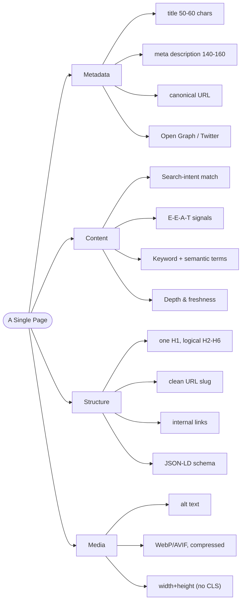
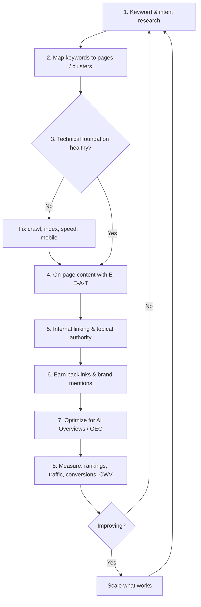

# SEO Playbook — On-Page & Off-Page

A practitioner reference for what makes a site rank, the parameters worth tracking, and
how RankMySEO's audit engine maps onto them. This is the knowledge base behind the
on-page checks in [`packages/core/src/engine/audit.ts`](../packages/core/src/engine/audit.ts).

---

## Knowledge foundation

The only authoritative sources are primary docs and the rater guidelines:

- **Google Search Central** + the **Search Quality Rater Guidelines** (definition of **E-E-A-T**).
- **Google Search Essentials** (formerly Webmaster Guidelines).
- **web.dev** — source of truth for **Core Web Vitals**.
- **Schema.org** — structured data vocabulary.
- **Bing Webmaster Guidelines** (now relevant for ChatGPT Search).

Books/practitioners: *The Art of SEO* (Enge et al.), Backlinko, Ahrefs/Moz blogs,
Aleyda Solís, Lily Ray (E-E-A-T), Marie Haynes (algorithm updates).

2026 frontier: **GEO/AEO** — Generative/Answer Engine Optimization — being the *cited
source* inside AI Overviews, ChatGPT Search, Perplexity, Gemini. The same fundamentals
(clear, factual, well-structured, trustworthy content) win here too.

> Meta-principle: Google rewards demonstrable expertise, trust, and a genuinely good
> user experience — not tricks.

---

## The big picture

```mermaid
graph TD
    SEO([SEO Strategy]) --> TECH[Technical SEO<br/>the foundation]
    SEO --> ON[On-Page SEO<br/>content & HTML]
    SEO --> OFF[Off-Page SEO<br/>authority & trust]
    SEO --> UX[UX & Core Web Vitals]
    SEO --> GEO[GEO / AEO<br/>AI & answer engines]

    TECH --> T1[Crawlability]
    TECH --> T2[Indexability]
    TECH --> T3[Site Architecture]
    TECH --> T4[Structured Data]

    ON --> O1[Content Quality / E-E-A-T]
    ON --> O2[Keyword & Intent Match]
    ON --> O3[HTML Tags & Semantics]
    ON --> O4[Internal Linking]

    OFF --> F1[Backlinks]
    OFF --> F2[Brand Signals]
    OFF --> F3[Local / Citations]
    OFF --> F4[Digital PR]

    UX --> U1[LCP / INP / CLS]
    UX --> U2[Mobile-first]

    GEO --> G1[Citable, factual content]
    GEO --> G2[Structured answers]
```

---

## On-page SEO — parameters

| Parameter | Target | RankMySEO check |
| --- | --- | --- |
| Title length | 50–60 chars, keyword front | `title-length` |
| Meta description | 70–160 chars | `meta-description` |
| Canonical | self-referencing / preferred URL | `canonical` |
| Single H1 | exactly one | `single-h1` |
| Subheading structure | ≥1 H2 | `heading-structure` |
| Open Graph | og:title/description/image | `og-tags` |
| Structured data | valid JSON-LD | `json-ld` |
| Image alt text | every meaningful image | `image-alt` |
| Content depth | not thin (≥ ~250 words) | `content-depth` |
| `<html lang>` | declared | `lang-attribute` |
| Mobile viewport | `<meta name=viewport>` | `viewport-meta` |
| Indexable | no `noindex` | `robots-indexable` |
| HTTPS | served over TLS | `https` |
| LCP | < 2.5 s | `cwv-lcp` |
| INP | < 200 ms (replaced FID, 2024) | `cwv-inp` |
| CLS | < 0.1 | `cwv-cls` |

---

## Off-page SEO — parameters

> Out of scope for the RankMySEO OSS audit engine (no backlink crawling in v1 — see
> [PRD §1 non-goals](../PRD.md)). Listed here as the practitioner reference; plug a
> custom `RankDataSource` to ingest these.

```mermaid
graph TD
    OFF([Off-Page SEO]) --> LINKS[Backlink Profile]
    OFF --> BRAND[Brand & Entity]
    OFF --> LOCAL[Local SEO]
    OFF --> SOCIAL[Social & PR]

    LINKS --> L1["referring domains (unique)"]
    LINKS --> L2["authority of linking sites"]
    LINKS --> L3["topical relevance"]
    LINKS --> L4["natural anchor text mix"]
    LINKS --> L5["dofollow/nofollow ratio"]
    LINKS --> L6["link velocity"]
    LINKS --> L7["toxic-link avoidance"]

    BRAND --> B1["branded search volume"]
    BRAND --> B2["unlinked mentions"]
    BRAND --> B3["Knowledge Graph entity"]
    BRAND --> B4["consistent NAP"]

    LOCAL --> LO1["Google Business Profile"]
    LOCAL --> LO2["citations / directories"]
    LOCAL --> LO3["reviews"]

    SOCIAL --> SO1["shares & engagement"]
    SOCIAL --> SO2["digital PR"]
```

| Parameter | What good looks like |
| --- | --- |
| Referring domains | steady growth of unique, relevant domains |
| Link quality | high-authority, topically relevant sources |
| Anchor text profile | mostly branded/natural; small exact-match % |
| dofollow/nofollow mix | natural blend |
| Link velocity | organic pace, no spikes |
| Toxic links | monitored; disavow only clear spam |
| Branded search | rising brand queries |
| Brand mentions | linked + unlinked |
| Google Business Profile | complete, verified, active |
| Reviews | volume + rating + recency + responses |
| NAP consistency | identical across citations |
| Digital PR | earned coverage in authoritative media |

---

## Core Web Vitals thresholds (2026)

| Metric | Good | Measures |
| --- | --- | --- |
| **LCP** | < 2.5 s | loading |
| **INP** | < 200 ms | responsiveness (replaced FID, Mar 2024) |
| **CLS** | < 0.1 | visual stability |

---

## Master workflow

